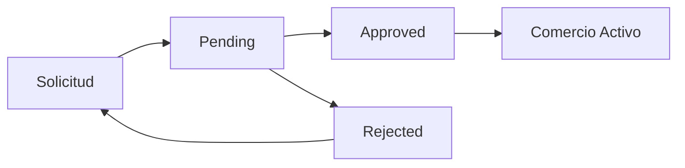
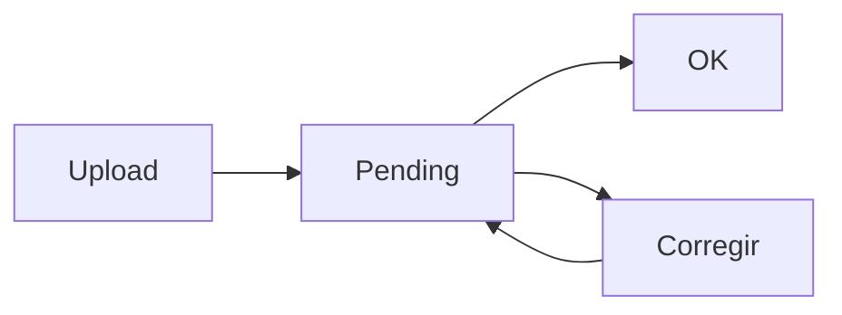

# 🏢 Sistema Mayorista - Artesellos

## 📋 Descripción General

Sistema completo de mayoristas (receptorías) integrado en la tienda de timbres Artesellos. Permite a comercios autorizados acceder a precios mayoristas, subir archivos para diseños personalizados y gestionar pedidos B2B.

## 🚀 Características Implementadas

### ✅ **Sistema de Roles y Autenticación**
- **4 Roles**: ANON, CLIENTE, COMERCIO, ADMIN
- **Solicitud de alta** de comercio con formulario completo
- **Estados de cuenta**: pending, approved, rejected
- **Middleware de protección** de rutas

### ✅ **Sistema de Precios Dinámicos**
- **3 Niveles de descuento**: A (30%), B (25%), C (20%)
- **Precios específicos** por producto (wholesale_price)
- **Precios por nivel** automáticos
- **Banner de tarifa** visible para usuarios mayoristas
- **Componente WholesalePrice** que reemplaza precios retail

### ✅ **Gestión de Archivos de Arte**
- **Uploader con validaciones** técnicas
- **Soporte para**: PDF, SVG, PNG, JPG
- **Validaciones automáticas**: DPI, dimensiones, formato
- **Estados de archivo**: pending, ok, corregir
- **Almacenamiento seguro** en Supabase Storage

### ✅ **Panel Mayorista**
- **Dashboard completo** para comercios aprobados
- **Vista pública** con información y solicitud
- **Vista pendiente** para cuentas en revisión
- **Gestión de trabajos** personalizados

### ✅ **Base de Datos Completa**
- **8 tablas nuevas** con RLS configurado
- **Triggers y funciones** para automatización
- **Políticas de seguridad** granulares
- **Storage bucket** para archivos

## 📁 Estructura de Archivos

```
src/
├── types/
│   └── wholesale.ts                 # Tipos TypeScript del sistema
├── lib/
│   └── hooks/
│       └── useWholesale.ts         # Hook para gestión mayorista
├── app/
│   └── mayoristas/
│       └── page.tsx                # Página principal mayoristas
├── components/
│   └── wholesale/
│       ├── WholesalePublicView.tsx      # Vista pública
│       ├── WholesaleApplicationForm.tsx # Formulario solicitud
│       ├── WholesaleDashboard.tsx       # Dashboard comercios
│       ├── WholesalePendingView.tsx     # Vista pendiente
│       ├── WholesalePrice.tsx           # Componente precios
│       └── FileUploader.tsx             # Uploader archivos

Scripts SQL:
├── wholesale-setup-supabase.sql    # Creación de esquema
└── wholesale-seed-data.sql         # Datos de prueba
```

## 🗄️ Esquema de Base de Datos

### **Nuevas Tablas**

1. **`wholesale_accounts`** - Cuentas mayoristas
2. **`product_prices`** - Precios específicos por producto  
3. **`custom_jobs`** - Trabajos personalizados
4. **`art_files`** - Archivos de arte subidos
5. **`wholesale_config`** - Configuración global

### **Tablas Extendidas**

- **`profiles`** - Agregado campo `role`
- **`orders`** - Agregados campos B2B

## 🔧 Instalación y Configuración

### **1. Instalar Dependencias**

```bash
npm install react-dropzone
```

### **2. Configurar Base de Datos**

```sql
-- 1. Ejecutar el schema principal
\i wholesale-setup-supabase.sql

-- 2. Cargar datos de prueba (opcional)
\i wholesale-seed-data.sql
```

### **3. Configurar Storage**

El bucket `art-files` se crea automáticamente en el script SQL. Verificar en Supabase Dashboard > Storage.

### **4. Configurar Variables de Entorno**

```env
# Ya configuradas en .env.local
NEXT_PUBLIC_SUPABASE_URL=tu_url
NEXT_PUBLIC_SUPABASE_ANON_KEY=tu_key
```

## 👥 Flujo de Usuario

### **1. Usuario No Logueado**
- Ve página pública `/mayoristas`
- Información de beneficios y requisitos
- CTA "Solicitar Alta de Comercio"

### **2. Usuario Logueado (Sin Cuenta Mayorista)**
- Ve formulario de solicitud
- Completa datos de empresa
- Sube comprobante (opcional)
- Estado cambia a COMERCIO role

### **3. Comercio Pendiente**
- Ve vista de estado pendiente
- Timeline del proceso
- Información de contacto

### **4. Comercio Aprobado**
- Accede a dashboard mayorista
- Ve precios mayoristas en todo el sitio
- Puede subir archivos para diseños
- Banner de nivel visible

### **5. Comercio Rechazado**
- Ve motivo de rechazo
- Puede solicitar nuevamente

## 💰 Sistema de Precios

### **Resolución de Precios**

1. **Precio específico** (`wholesale_price`) → Usa este precio
2. **Nivel override** del producto → Aplica descuento específico
3. **Nivel del usuario** (A/B/C) → Aplica descuento del nivel
4. **Sin configuración** → Precio retail normal

### **Niveles de Descuento**

```typescript
const LEVEL_DISCOUNTS = {
  A: 30, // -30%
  B: 25, // -25%
  C: 20  // -20%
}
```

### **Ejemplo de Cálculo**

```typescript
// Producto retail: $100
// Usuario Nivel A (30% desc): $70
// Precio específico $60: $60 (ignora nivel)
```

## 📤 Sistema de Archivos

### **Validaciones Técnicas**

- **Vectores**: PDF/SVG, 1 color, sin transparencias, trazo ≥0.25pt
- **Raster**: PNG/JPG, ≥1200×1200px, ≥600 DPI, B/N, fondo blanco
- **Tamaño**: Máximo 10MB por archivo
- **Cantidad**: Máximo 3 archivos por ítem

### **Estados de Archivo**

- **`pending`**: Recién subido, esperando revisión
- **`ok`**: Aprobado por admin
- **`corregir`**: Necesita ajustes técnicos

## 🛡️ Seguridad y Permisos

### **Row Level Security (RLS)**

- **wholesale_accounts**: Solo ve su propia cuenta
- **custom_jobs**: Solo ve sus propios trabajos
- **art_files**: Solo ve sus propios archivos
- **Admins**: Ven todo

### **Storage Policies**

- **Upload**: Solo en su carpeta (`user_id/filename`)
- **Read**: Solo sus archivos o admin

## 🔗 Integración con Componentes Existentes

### **ProductCard Modificado**

```tsx
// Antes
<span className="text-lg font-bold">${product.price}</span>

// Después  
<WholesalePrice 
  productId={product.id}
  retailPrice={parseFloat(product.price)}
  showLabel={false}
/>
```

### **Layout con Banner**

```tsx
<Navbar />
<WholesaleLevelBanner />  // Nuevo
<main>{children}</main>
```

## 📊 Métricas y Administración

### **Panel Admin (Pendiente)**

- Aprobación de comercios
- Gestión de precios
- Revisión de archivos
- Auditoría

### **Métricas Sugeridas**

- Tasa de conversión mayorista
- Ticket promedio B2B vs B2C
- % archivos rechazados
- Tiempo de aprobación

## 🚦 Estados y Flujos

### **Estados de Cuenta Mayorista**



### **Estados de Archivo**



## 🧪 Datos de Prueba

### **Cuentas Creadas**

1. **Papelería Central** (Nivel A, 30% desc)
2. **Oficina Total** (Nivel B, 25% desc)  
3. **Librería Campus** (Pendiente)
4. **Negocio Raro** (Rechazado)

### **Productos con Precios**

- Producto 1: $25 retail → $18 mayorista
- Producto 2: $26 retail → $20 mayorista
- Producto 3: $22 retail → $15 mayorista

## 🔄 Próximos Pasos

### **Alta Prioridad**

1. **Panel de Administración** completo
2. **Checkout B2B** con facturación
3. **Integración Mercado Pago** mayorista
4. **Sistema de crédito** a 7 días

### **Media Prioridad**

5. **Notificaciones** por email
6. **Dashboard de métricas**
7. **Exportación** de reportes
8. **API endpoints** para móvil

### **Baja Prioridad**

9. **Workflow** de aprobación avanzado
10. **Sistema de comisiones**
11. **Integración** con ERP
12. **App móvil** para mayoristas

## 🐛 Resolución de Problemas

### **Error: RLS Policy**
```sql
-- Verificar políticas
SELECT * FROM pg_policies WHERE tablename = 'wholesale_accounts';
```

### **Error: Storage Access**
```sql
-- Verificar bucket
SELECT * FROM storage.buckets WHERE id = 'art-files';
```

### **Error: Role No Actualizado**
```sql
-- Verificar roles de usuario
SELECT id, role FROM profiles WHERE id = 'user_uuid';
```

## 📞 Soporte

Para dudas sobre el sistema mayorista:

- **Email**: mayoristas@artesellos.com
- **Teléfono**: +56 9 1234 5678
- **Documentación**: Este README

---

## 📝 Changelog

### **v1.0.0** (Actual)
- ✅ Sistema completo de roles y autenticación
- ✅ Precios dinámicos por nivel
- ✅ Uploader de archivos con validaciones
- ✅ Panel mayorista básico
- ✅ Base de datos con RLS

### **v1.1.0** (Próximo)
- 🔄 Panel de administración
- 🔄 Checkout B2B
- 🔄 Integración Mercado Pago B2B

---

**Sistema desarrollado para Next.js 15 + TypeScript + Supabase + Tailwind CSS**
